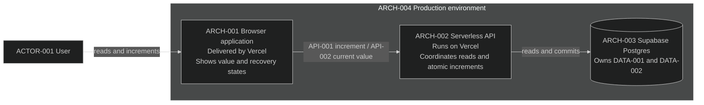

# Stack context

`ARCH-001` through `ARCH-004` provide `CAP-001` for Counter 1.0.

`SEQ-001` and `SEQ-002` show the consequential communication among these nodes.

## Current rationale

- The browser owns only interaction state because durable state in the client
  would make reload and unknown-outcome recovery unreliable.
- The serverless API owns reads and increments because the browser must not be
  authoritative for validation or mutation of the shared value.
- Supabase Postgres owns `DATA-001` and `DATA-002` because the counter update
  and request receipt must commit together to prevent duplicate increments and
  allow reconciliation after a lost response.
- Vercel hosts the browser and API so the complete user-facing path can be
  deployed together, while Supabase separately provides durable database state.
- Backups and rollback-safe data handling are necessary because application
  deployment or rollback must not reset the product's persisted counter.
