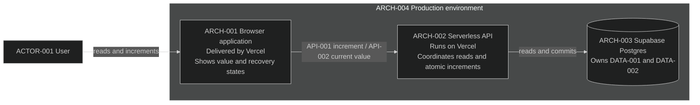

# Stack context

## Module: Counter

Module owner: [Counter](../modules/counter/experience/user-flows.md#flow-001-read-and-increment-the-counter).
This section is the Counter module's physical context, not a separate runtime
boundary. Counter is the only module in this small example.

`ARCH-001` through `ARCH-004` provide `CAP-001` for Counter 1.0.

The [Counter module sequences](../modules/counter/sequences/sequences.md)
own consequential communication and atomicity; the
[module's quality constraints](../modules/counter/quality/constraints.yaml)
own persistence across deployment and rollback. This view maps physical owners.

### Current rationale

- The browser owns only interaction state because durable state in the client
  would make reload and unknown-outcome recovery unreliable.
- The serverless API owns reads and increments because the browser must not be
  authoritative for validation or mutation of the shared value.
- Supabase Postgres owns `DATA-001` and `DATA-002` because the counter update
  and request receipt must commit together to prevent duplicate increments and
  allow reconciliation after a lost response.
- Vercel hosts the browser and API so the complete user-facing path can be
  deployed together, while Supabase separately provides durable database state.
