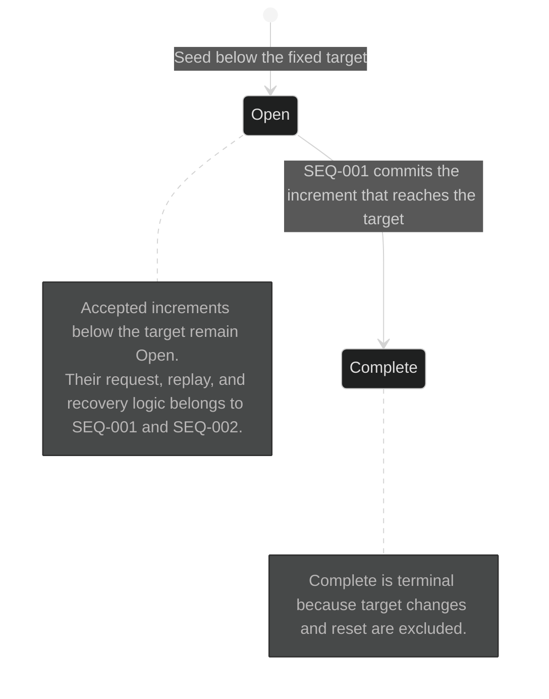

# State machines

## SM-001 Counter lifecycle

## Current rationale

- `Open` and `Complete` are separate durable states because they allow different
  product actions: Open permits Increment, while Complete does not.
- Increments below the target are intentionally absent as self-loops because
  they do not change the stable lifecycle state; `SEQ-001` owns their detailed
  request, transaction, replay, and failure logic.
- Completion is terminal because changing or resetting the fixed target is
  outside this release.
