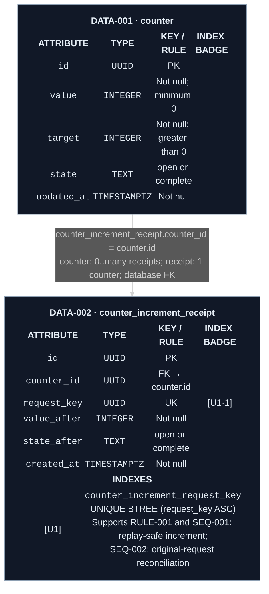

# Data model

`DATA-001 Counter record` owns shared progress. `DATA-002 Increment receipt`
records the result of each accepted request so a lost response can be reconciled
without applying the increment again.

The exact physical tables are `counter` for `DATA-001` and
`counter_increment_receipt` for `DATA-002`.

Legend: green `[U1]` identifies one unique index; `[U1·1]` marks its first
ordered key. Routine primary keys remain `PK`. Index behavior belongs to
[RULE-001](../behavior/rules.yaml),
[SEQ-001](../sequences/sequences.md#seq-001-increment-once), and
[SEQ-002](../sequences/sequences.md#seq-002-load-or-reconcile-progress).

There is exactly one counter record, seeded at deployment with `value: 0`, a
fixed positive target, and `state: open`. `RULE-001` owns increment and
completion behavior. The routine primary-key indexes remain implicit; `[U1]` is
shown because request-key uniqueness protects a product-significant outcome.

## Current rationale

- One singleton `DATA-001` represents the shared counter because the product
  excludes accounts, multiple counters, and multi-tenancy.
- The value, target, and state commit together because otherwise the visible
  completion state could disagree with durable progress.
- `DATA-002` commits with the accepted increment because a durable result keyed
  by the original request lets `SEQ-002` reconcile a lost response without
  creating another mutation.
- `[U1]` makes one request key identify at most one receipt because otherwise a
  replay or concurrent duplicate could advance progress more than once.
- The receipt stores the resulting value and state because reconciliation must
  return the outcome of that exact request, not merely a later counter value.
- Both records are retained for the product lifetime and protected by backups
  or exports because deployment, rollback, or infrastructure failure must not
  reset progress or erase replay protection.
