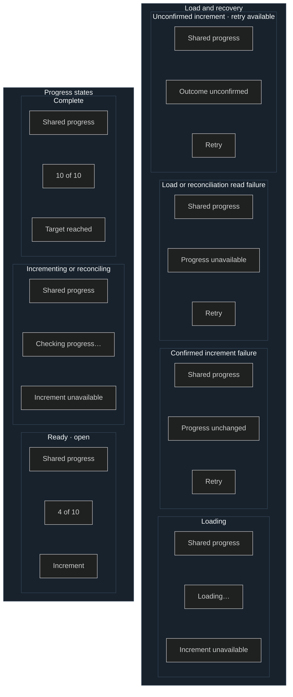

# SCREEN-001 Counter screen

This low-fidelity local mockup is the exact content hierarchy and interaction
target for `SCREEN-001` in the example. It deliberately leaves typography,
color, spacing tokens, and framework choice to implementation.

Required variants are loading, ready/open, confirmed increment failure, read
failure, unconfirmed increment with Retry available, incrementing, reconciling,
and complete. [FLOW-001](../user-flows.md#flow-001-read-and-increment-the-counter)
owns transitions; this mockup owns the shared hierarchy and visible controls.

## Current rationale

- Every variant keeps the same title and progress position because the user is
  completing one continuous goal rather than navigating among separate views.
- Increment is unavailable while loading, incrementing, or reconciling because
  those states cannot safely accept another product action.
- Retry is the only action on failure and unconfirmed-result variants because
  recovery must not expose a fresh Increment or Dismiss before resolution.
- Complete replaces the action with `Target reached` because reset and target
  changes are outside this release.
