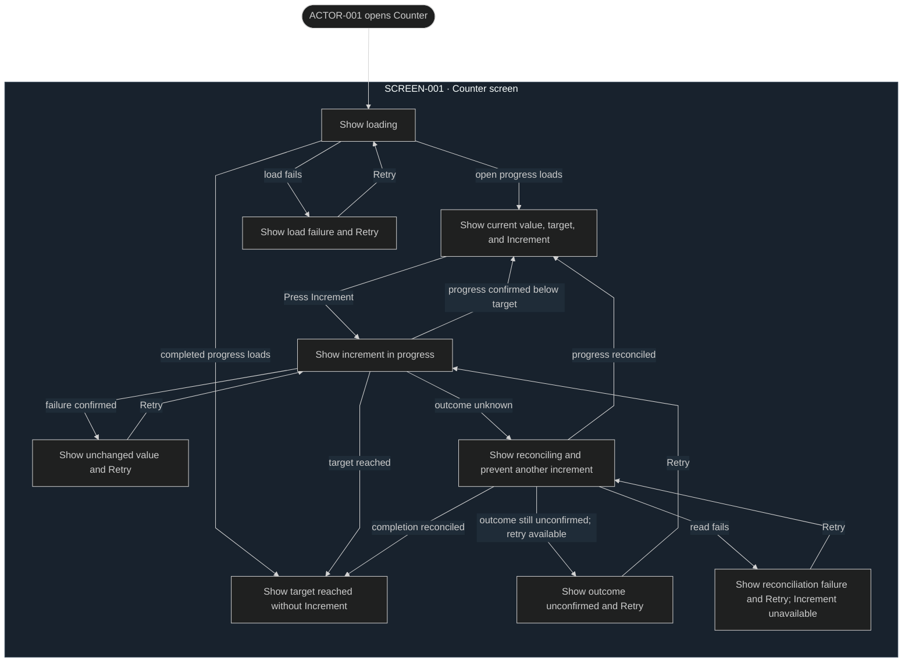

# User flows

## FLOW-001 Read and increment the counter

The flow takes place on `SCREEN-001 Counter screen`. Increment actions and
their retries use [SEQ-001](../sequences/sequences.md#seq-001-increment-once);
loads and reconciliation reads use
[SEQ-002](../sequences/sequences.md#seq-002-load-or-reconcile-progress).
Visible outcomes obey [RULE-001](../behavior/rules.yaml).

**Exact local design target:**
[`SCREEN-001 Counter screen`](mockups/screen-001-counter.md#screen-001-counter-screen)

The flow owns actor actions and visible outcomes. Runtime calls and commit
behavior belong to the linked sequences and `RULE-001`.

## Current rationale

- One responsive, centered screen is sufficient because the product has one
  user goal and no secondary navigation or account surfaces. Its exact local
  target is linked above so the surface inventory is not mistaken for layout.
- Loading, ready, error, submitting, and reconciling remain visibly distinct
  because each state gives the user different available actions and certainty
  about the persisted value.
- The reconciling state blocks another increment because the prior request may
  already have committed; another request could create an unintended duplicate.
- Recovery distinguishes an unchanged result, an unconfirmed result, and a
  failed read because Retry must perform the appropriate operation without
  presenting an uncertain increment as a new action.
- Completion removes Increment because the fixed target is the terminal product
  outcome and changing or resetting it is outside this release.
- A native keyboard-operable button and announced state changes are necessary
  for assistive-technology use. Animation is unnecessary for understanding the
  state changes.
