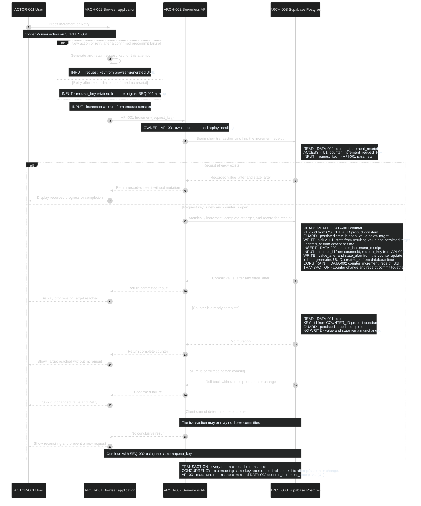
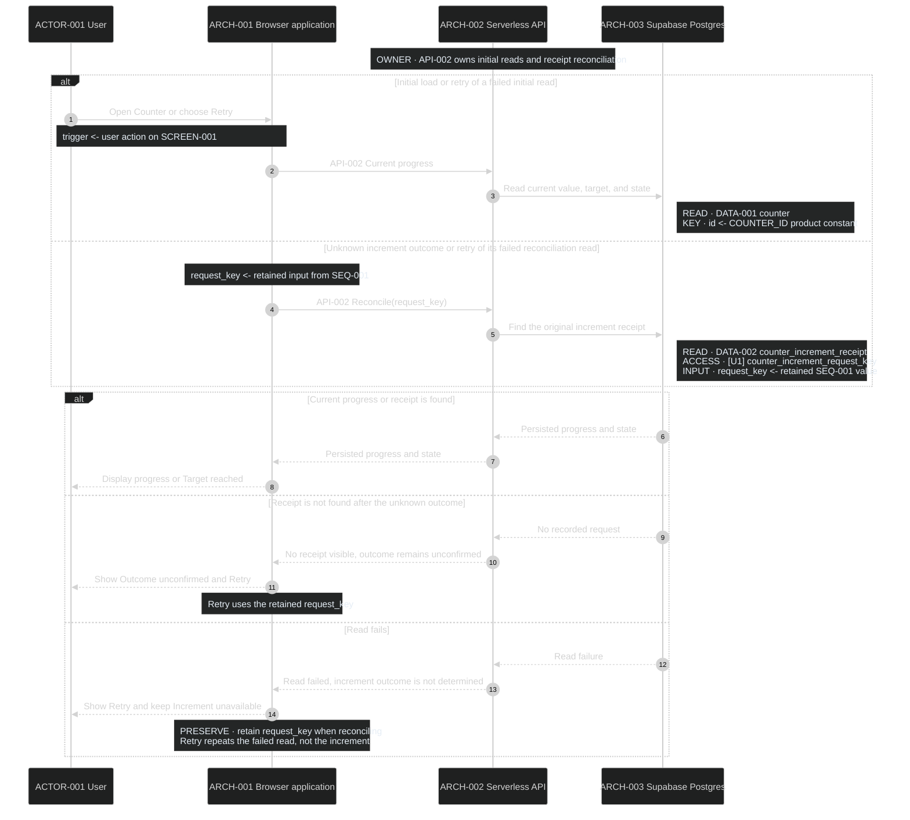

# Sequences

## SEQ-001 Increment once

This sequence applies [RULE-001](../behavior/rules.yaml) to
[DATA-001 and DATA-002](../data/data-model.md) during
[FLOW-001](../experience/user-flows.md#flow-001-read-and-increment-the-counter).

**DCL:** 4 (product default)

### Current rationale

- The browser creates one request key for a new action and retains it through
  reconciliation because a network failure must not turn uncertainty into a
  second product action. When reconciliation finds no receipt, Retry uses the
  original key; a known precommit failure may start a new attempt with a new key.
- The API checks `[U1]` before mutation and returns an existing receipt because
  replaying a recorded request is a read, not another increment.
- The counter update, completion transition, and receipt insert share one short
  transaction because partial commit would make progress, state, and replay
  protection disagree.
- A failure known to occur before commit may offer Retry because the value and
  receipt are known to be unchanged.
- An unknown outcome does not create a new request because the first transaction
  may already have committed; `SEQ-002` reconciles the original key.

## SEQ-002 Load or reconcile progress

This sequence loads [DATA-001](../data/data-model.md) initially and resolves an
unknown [SEQ-001](#seq-001-increment-once) outcome through DATA-002 during
[FLOW-001](../experience/user-flows.md#flow-001-read-and-increment-the-counter).

**DCL:** 4 (product default)

### Current rationale

- Initial load and reconciliation share one read process because each must
  return authoritative progress without creating a new product action.
- Reconciliation looks up the original request receipt rather than inferring
  success from the latest counter value because other users may have advanced
  the counter afterward.
- A missing receipt permits Retry only with the retained request key because a
  concurrent original transaction and its retry must still resolve to one
  `[U1]` receipt.
- Increment remains unavailable after a read failure because the browser cannot
  safely present or mutate progress it has not reconciled.
