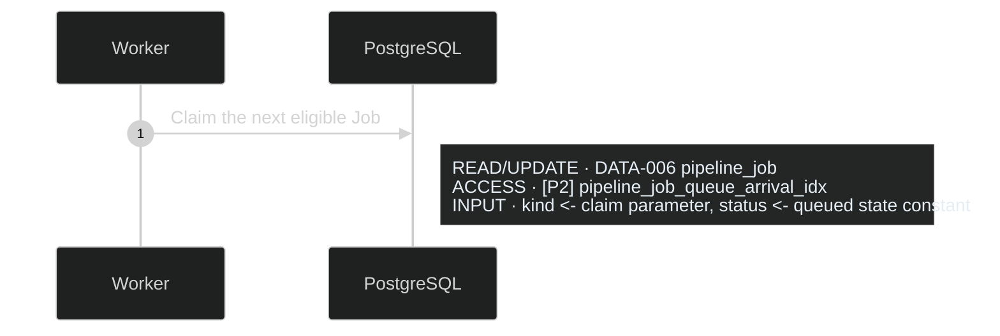
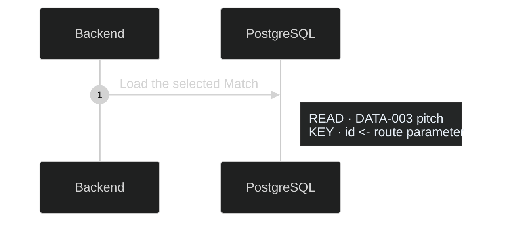

# Artifact Responsibilities

## Selection rule

Use the smallest set of artifacts that answers the product questions at hand.
Every artifact must own distinct information. If two artifacts explain the same
fact, keep it in the more appropriate owner and link to it.

The three default files establish product scope, the physical system map, and
actor flows. Put simple acceptance in `product.yaml`. Add these only when
triggered:

| Optional artifact | Add when |
| --- | --- |
| Detailed acceptance | Several scenarios, failure paths, cross-capability behavior, or quality outcomes make inline acceptance hard to read |
| Editing authority | Agents or contributors need a durable way to verify who may request canonical PIP edits and at what scope |
| Journey map | Intended phases, recurrence, role changes, or handoffs add context a focused flow cannot show |
| Screen records | Surface-specific content, actions, validation, responsive behavior, or visible states need detail beyond the flow or linked design |
| Design records | Repeated visual, content, component, interaction, responsive, or accessibility rules constrain the product |
| Rules or decision table | Several conditions, priorities, permissions, or calculations select an outcome |
| State machine | A product or domain object has meaningful lifecycle states and transitions |
| Data model / ERD | Entity identity, ownership, relationships, or cardinality affect the product |
| Schema detail | Fields, constraints, retention, or compatibility are product-significant |
| API, event, or integration contract | A boundary is shared, external, compatibility-sensitive, or product-significant |
| Sequence | Ordered cross-system work, async behavior, or recovery changes an outcome |
| Quality constraints | A measurable performance, reliability, security, privacy, accessibility, compatibility, operations, or cost bound matters |
| Separate deployment view | Environment, region, network, failover, or rollout topology makes stack context hard to read |
| Separate coordination view | Several processes or coordination mechanisms make the stack-context coordination overlay hard to read |

Do not create a file merely to record `not applicable`.

## Diagram responsibilities

| View | Question it owns | Intentionally omits |
| --- | --- | --- |
| Stack context | Which physical systems exist, what does each own, where does it run, and how do they connect? | Screen navigation, ordered messages, entity fields, detailed lifecycle transitions |
| User flow | What does the actor do, see, choose, and experience next, and which surfaces need design? | APIs, services, database work, retries, algorithms, and other internal execution |
| State machine | Which stable lifecycle states and process-triggered transitions are valid? | Each process's ordered calls, retries, fallbacks, and screen navigation |
| Data model / ERD | Which concepts or persisted entities exist, and how do they relate? | Navigation, message order, process transitions, and a full implementation schema |
| Sequence | How does one consequential process execute across physical systems? | Screen topology, complete entity modeling, and the full object lifecycle |

These five views are enough for ordinary application work. A decision table is
a supporting logic format, not another diagram type. Deployment normally stays
inside stack context. Do not add component, container, system-context,
screen-map, domain-model, or similar diagrams that repeat these views.

Coordination is an optional overlay on stack context, not a sixth default
diagram responsibility. It shows which physical processes contend through
which mechanism and what resource the mechanism protects. The ERD owns any
persisted lease structure, and a sequence owns acquisition, renewal, timeout,
retry, fencing, release, and recovery order.

Keep diagrams with the same responsibility consolidated until readability
requires focused files. If split, use one ID-named Markdown file per diagram and
a simple linked table of contents. That table is navigation, not a registry or
trace graph.

## One fact, one owner

| Information | Owner |
| --- | --- |
| Release, outcome, boundary, actors, capabilities, simple acceptance, exclusions, measures, default DCL | `product.yaml` |
| Detailed or cross-capability scenarios | Optional `acceptance.yaml` |
| Current reason for a diagrammed design | `Current rationale` in the owning diagram file |
| Actor action, navigation, visible outcome, visible recovery, surface inventory | User flow |
| Surface-specific content and actions | Screen or linked design record, when needed |
| Condition combinations that select an outcome | Rule or decision table |
| Valid states and process-triggered transitions | State machine |
| Ordered calls, events, input provenance, database table use and intended access paths, retries, fallbacks, and runtime failure | Sequence |
| Physical responsibility, owned state, provider, deployment placement, trust boundary | Stack context |
| Cross-process contenders, coordination scope, mechanism, and protected resource | Stack-context coordination overlay |
| Entity identity, relationship, and cardinality | Data model / ERD |
| Request, response, event, and error shape | Contract |
| Product-significant field or storage constraint | Schema detail |
| Narrow DCL exception | `dcl_override` on the owning YAML record or a DCL line in the owning Markdown file |
| Current canonical editing authority and scope | Optional `governance.yaml` |

## Current rationale

Put a short `Current rationale` section in each diagram file that contains a
non-obvious product, experience, data, process, or architecture choice. List all
active reasons a reader needs to understand the current design. State cause and
effect, the constraint being protected, and a material tradeoff when it matters.

Do not tell the history of the product. Avoid dates, former designs, “we changed
from,” rejected alternatives that no longer constrain the design, or a sequence
of decisions. Git owns that history. Do not repeat one rationale in several
views: the stack file explains physical boundaries, the user flow explains
visible surface choices, the state machine explains lifecycle distinctions, the
ERD explains product-significant data shape, and the sequence explains detailed
process choices.

## Preserve context with direct links

- A `FLOW-*` action may link to the `SEQ-*` that performs consequential work.
- A sequence uses the same `ARCH-*`, `API-*`, `EVT-*`, and `DATA-*` IDs as the
  physical and boundary records.
- A sequence ends at the same visible `SCREEN-*` outcome or durable `SM-*`
  state used by the flow or state machine.
- A state transition links to a sequence when process ownership or coordination
  matters.
- A coordination overlay links a product-significant mechanism to the `SEQ-*`
  that owns its runtime behavior and the `DATA-*` that stores lease state.
- Acceptance scenarios name the `CAP-*`, `RULE-*`, `SM-*`, `SEQ-*`, or quality
  outcome they verify.

Share an ID and short label. Do not copy the selecting rule, transition
definition, or runtime messages into every view.

## User flows

A user flow owns observable experience. Include the actor goal and entry point,
actions and choices, surface topology, visible states, alternate paths,
cancellation, failure, recovery, and terminal outcomes that matter.

Treat internal work as a black box between actor action and visible response. A
flow may show `access denied`, `no results`, or another visible product
condition, but it must not show membership lookups, API or database calls,
query mechanics, cursors, retries, idempotency, or invisible state.

Prefer labeled edges for navigation choices and visible permission,
availability, or validation outcomes. Use a diamond only for a question visibly
presented to the actor. When internal conditions route to different surfaces,
use one compact product-condition node and put the selection logic in a rule,
decision table, or sequence.

Keep one actor goal or closely related outcome in one flow. Use a short overview
and linked subflows when crossing lines obscure the actor path. Keep screen
topology here; do not create a separate screen map.

Make every consequential surface explicit with a labeled boundary such as
`SURFACE · Match Feed` or, when cross-referenced, `SCREEN-001 · Match Feed`.
Put the actions and visible states owned by that surface inside it and label
transitions between surfaces. This inventory tells designers which pages,
views, dialogs, panels, components, or messages need mockups. It is not a
wireframe, and not every flow node needs a separate mockup.

Place the exact current mockup frame or node, version or branch, and companion
example or export-code reference next to the affected surface. That mockup is
the visible and interaction target. Implementers must preserve its surface and
component inventory, content hierarchy, states, and interactions. They may
adapt example code to repository, accessibility, and security needs, but may
not silently add, remove, merge, split, or redesign product surfaces. Raise a
material conflict through the product or design leader.

A link to an entire Figma file, design project, board, or folder provides
context but does not identify an exact implementation target. Treat it as
binding only after the affected surface points to the governing frame or node
and, when ambiguity is possible, the applicable branch or version. A local
mockup should likewise link to the exact file and named surface or variant.

## Sequences

Prefer the numbered, annotated presentation in
[Diagram Presentation](diagram-presentation.md#annotated-sequences): readable
action arrows with adjacent labeled execution and data notes.

A sequence owns detailed process logic for one consequential process. Include
its trigger, physical `ARCH-*` participants, ordered synchronous or asynchronous
messages, input provenance, authority and data boundaries, durable change, and
material decision, timeout, retry, fallback, duplication, partial failure,
compensation, or recovery behavior.

Recommend a DCL line above each implementable sequence:

```text
**DCL:** 4 (product default)
```

or:

```text
**DCL override:** 6 — Interactive retrieval must remain bounded while users wait.
```

The product default comes from `product.yaml`; a local override belongs to this
process and does not propagate to its user flow or state machine. Do not put an
implementation DCL comparison in the PIP.

For an existing codebase, inspect the implementation before writing the
sequence. Keep physical systems as lifelines. In a message or adjacent note,
name only the intended path and function, handler, job, or module needed to
make ownership clear and prevent duplicate implementation. State its runtime
responsibility: “`loadProgress()` reads current progress and reconciles unknown
outcomes.” Preserve suitable existing owners. Put instructions to reuse,
modify, replace, migrate, or create code in external implementation notes, not
in the sequence or a supporting task list. Do not build a complete call graph.

For each consequential input, state its origin: user input and surface, named
function parameter or return, persisted field, external response or event, or
named constant, configuration, or setting. Labels such as `store_id <- user
selection`, `limit <- MATCH_LIMIT setting`, or `rows <- load_rows() return` are
enough. Omit incidental local variables.

When a sequence ends in manual fallback, show safe containment and the
notification or handoff that makes the responsible admin aware. Include enough
incident identity and context to locate the case. The admin actor and an
existing monitored notification channel are enough; do not invent a dedicated
admin application, screen, or control unless it performs a required action.

Qualify ambiguous terms such as `eligible`, `safe`, `valid`, and `shared` with
the domain, processing stage, population, data, algorithm, lifecycle, or output
they constrain. A publication rule does not silently become a retrieval rule.

Use the physical client as a participant; a `SCREEN-*` is a visible starting or
resulting surface, not a runtime lifeline. Split sequences only when message
order, ownership, or recovery materially differs. A sequence may name the state
transition it causes but must not restate the lifecycle model.

### Database access in sequences

For each consequential database interaction, show the logical operation,
`DATA-*` ID, exact physical table or view, and how the step locates or constrains
the relevant rows. Default to the ERD's index badge when a canonical index is
the intended access path because that badge already identifies its keys,
predicate, expressions, and included columns. If no canonical index applies,
show the exact key lookup, join, filter, or mutation fields instead.



Without an applicable canonical index:



When one logical database call reads, joins, or writes several product tables,
list each table and its distinct role in one adjacent note. Do the same for the
product-significant tables behind an encapsulating function or view; omit
incidental database catalogs and engine internals. Keep the physical database
as the lifeline rather than turning tables into participants.

The sequence references an index badge and short name; the ERD remains the sole
owner of the complete index definition. A query planner may choose a different
physical plan, so `ACCESS` means the intended or required access path, not a
claim about every runtime execution. Do not promote every routine index into
the PIP. If a particular index is required for a product latency, capacity,
ordering, or correctness outcome, document it as product-significant in the ERD
and reference its badge. Otherwise show the relevant key fields and leave
physical index choice to engineering.

### Database coordination in sequences

Treat explicit application-controlled locks, advisory locks, stronger-than-
normal isolation, singleton requirements, globally serialized queues, and
similar restrictions on independent work as exceptional. Show one only when it
affects product correctness, capacity, latency, or recovery. State:

- the named invariant and concrete race or failure it prevents;
- the narrowest row, key, tenant, job, or other scope and affected processes;
- why a uniqueness or exclusion constraint, atomic conditional statement,
  optimistic version check, idempotency rule, short transaction, or partitioned
  work cannot protect the invariant more simply; and
- acquisition/release, timeout, recovery, and contention cost only when those
  change a stated outcome or bound.

Do not hold a lock across slow external I/O without an unavoidable invariant and
explicit tradeoff. Do not serialize unrelated rows, tenants, jobs, or processes
for hypothetical races, and do not require oversized database infrastructure to
compensate for avoidable contention. Ordinary short-lived database locks used
internally for atomic statements or constraints do not require PIP detail.

For a product-significant lease, the sequence owns acquisition, renewal,
expiry, stale-owner rejection, fencing, release, and recovery order. For a
product-significant lock, it owns acquisition, timeout or refusal, release, and
recovery. Do not copy that order into an ERD or coordination overlay.

## State machines

A state machine owns stable lifecycle states, triggers, guards, permitted and
forbidden transitions, and durable or product-significant failure and recovery
states. It is the high-level map of how the processes represented by sequences
interact.

Name the triggering process and link a consequential transition to its `SEQ-*`
when useful. When it crosses physical services, name where the transition is
initiated, where it becomes valid or durable, and which system executes or
observes it. Do not copy ordered calls, retries, fallback attempts, timeouts,
screen navigation, or database fields into this view.

Omit polling cycles, heartbeats, lease renewals, retry attempts, progress ticks,
and other routine self-loops when they do not change a stable lifecycle state.
Their timing, limit, failure, and recovery logic belongs in the owning sequence.
If a repeated operation has a product-significant result without changing state,
mention that invariant in a short note and link the sequence rather than drawing
its internal loop.

## Data models and ERDs

Prefer the custom table-node presentation in
[Diagram Presentation](diagram-presentation.md#custom-table-shaped-erds) when
fields, index badges, or coordination compartments carry product meaning.

Use one data-model view for conceptual relationships and persisted entities.
Show identity, ownership, relationships, cardinality, and product-significant
constraints. Keep conceptual and persisted meanings distinct when both are
needed, even if one diagram shows their mapping. Do not use the ERD for
navigation, process order, transition validity, or a full database definition.

Not being a full schema does not permit hiding persisted product behavior. In
the owning entity, show every persisted column individually by its exact
physical name and type when its value affects selection, ranking, eligibility,
authorization, lifecycle, recovery, compatibility, a visible outcome, or audit
behavior that itself matters to the product. Show its product-significant null,
key, uniqueness, range, enumeration, retention, or other constraint when
applicable. Do not replace several such fields with an invented summary row
such as `fitness_controls SMALLINT × 5`; show the five physical columns.

Omit incidental implementation-only columns that do not change product meaning.
An entity repeated only to provide context in another diagram may use a clearly
labeled `REFERENCE PROJECTION` with an explicit link to the owning `DATA-*`
entity and abbreviate fields not needed for that relationship. A reference
projection does not redefine the entity and must not conceal a product fact
needed to understand the diagram.

### Product-significant index notation

When an index is product-significant, use the combined badge-and-compartment
convention:

1. Assign one base badge to exactly one physical index definition. `[I1]` may
   identify only one index; it must never label two definitions, variants, or
   alternatives. Two indexes receive two badges even when they use the same
   keys, support the same sequence, or differ only by predicate.
2. Choose the prefix from the definition: `I` for an ordinary non-unique index,
   `U` for an ordinary unique index or constraint, and `P` for a partial,
   expression, or otherwise specialized index. Use `P` for a specialized index
   even when it is also unique, and state `UNIQUE` in its full definition.
3. Put the base badge plus a role suffix on every affected attribute row.
   `·1`, `·2`, and so on mean first, second, and subsequent direct key columns
   in that index's order; they do not mean table-column position or sort
   direction. Use `·expr` when the attribute supplies a separate indexed
   expression, `·inc` for an included column, and `·where` only when the
   attribute participates solely in the predicate. A direct key or expression
   may also appear in the predicate, but it keeps its numeric or `·expr` badge;
   do not add a redundant same-index `·where` badge. Show every badge when one
   column participates in several indexes. Every badged attribute must be the
   exact physical column with its exact type; never attach an index badge to a
   grouped, synthetic, or abbreviated projection row.
4. Repeat each base badge once in an `INDEXES` compartment immediately below
   the entity. Write that index's complete current definition; do not use
   shorthand such as `same key`, combine multiple physical names in one entry,
   or require the reader to infer keys, directions, includes, expressions, or
   predicates from another badge. Use matching colors when the tool allows,
   while retaining text so color is never the only signal.

The compartment owns only the current intended definition and relevant reason:
physical name when needed, uniqueness and method, ordered keys and direction,
predicate or expression, included columns, owning query or process, and product
purpose through a direct `SEQ-*`, `RULE-*`, or `QC-*` link. A candidate index
belongs in an isolated PIP fork, not beside the canonical index with a proposal
status.

```text
ATTRIBUTE               TYPE   KEY / CONSTRAINT   INDEX BADGE
match_id                 UUID   FK                 [P1·1]
publication_request_id   TEXT   UK                 [U2·1]
token                    TEXT   UK                 [U1·1]
disabled_at              TIME                      [P1·where]

INDEXES
[U1] pitch_card_token_key
     UNIQUE BTREE (token ASC)
     Supports SEQ-008: stable public-token lookup

[U2] pitch_card_publication_request_key
     UNIQUE BTREE (publication_request_id ASC)
     Supports SEQ-002: replay-safe publication

[P1] pitch_card_one_active_per_pitch_idx
     UNIQUE BTREE (match_id ASC) WHERE disabled_at IS NULL
     Supports RULE-001: at most one active page per Match
```

Indexes with the same ordered keys but different predicates remain separate:

```text
ATTRIBUTE       TYPE         INDEX BADGE
kind            TEXT         [P2·1] [P3·1]
enqueued_at     TIMESTAMPTZ  [P2·2] [P3·2]
id              TEXT         [P2·3] [P3·3]
available_at    TIMESTAMPTZ  [P2·inc]
status          TEXT         [P2·where] [P3·where]
priority        TEXT                    [P3·where]

INDEXES
[P2] pipeline_job_queue_arrival_idx
     BTREE (kind ASC, enqueued_at ASC, id ASC)
     INCLUDE (available_at)
     WHERE status = 'queued'
     Supports SEQ-010: ordinary queue claims

[P3] pipeline_job_requested_store_queue_idx
     BTREE (kind ASC, enqueued_at ASC, id ASC)
     WHERE status = 'queued' AND priority = 'requested_store'
     Supports SEQ-010: requested-Store queue claims
```

Here `kind` has two badges because it is the first key column in two different
indexes. The shared `·1` suffix does not combine the indexes; `[P2]` and `[P3]`
remain independent definitions. If `priority` comes from an expression over a
payload rather than a stored column, put `[P3·expr]` on the source attribute and
write the exact expression in `[P3]`.

One attribute may legitimately have both numeric and `·expr` badges for the
same base index only when the full definition contains two distinct roles: a
direct ordered key and a separate expression derived from that attribute. Do
not use two badges merely because one direct key also appears in `WHERE`.

An index may support an owning product rule; its predicate cannot establish the
rule by itself. Define the meaning, affected population, owner, update
lifecycle, and consumers of any product classification before encoding it in a
partial index or constraint. Inspect current schema, migrations, and owning
queries before naming a physical index. Omit routine primary-key and ordinary
implementation indexes unless their behavior is independently product-
significant. Ordinarily, show a primary-key column as `PK` in the entity and do
not give its automatically created index a `U*` badge or `INDEXES` entry. Add
one only when its particular physical definition or query responsibility is
itself required product intent, not merely because it owns row identity.

### Product-significant lock and lease notation

Use the ERD only for persisted coordination structure. A stored lease may use
textual badges such as `[LEASE1·scope]`, `[LEASE1·owner]`,
`[LEASE1·until]`, `[LEASE1·fence]`, and, when it is durable,
`[LEASE1·state]`. Repeat the base badge in a `COORDINATION` compartment below
the entity:

Every coordination badge must identify the exact persisted physical column and
type. Do not place a lease or lock role on a grouped field or a cross-diagram
reference projection.

```text
COORDINATION
[LEASE1] COORD-001 Store assembly lease
         SCOPE: store_id
         OWNER: lease_owner
         EXPIRES: leased_until
         FENCE: lease_version
         PROTECTS: DATA-007 publication
         DETAILS: SEQ-014
```

Use `[LOCK1]` for a persisted lock record. Matching colors may distinguish
locks from leases, but text is canonical and color must not be the only signal.
Do not put a transaction or advisory lock in the ERD when it has no persisted
fields; show a product-significant transient lock in its sequence and, only
when its contention relationships need explanation, the coordination overlay.
This notation documents an already justified mechanism; it does not make a
lock or lease necessary.

## Stack context and deployment

Stack context is the sole system-context diagram. Show actors, product boundary,
external systems, physical clients, deployed services, workers, managed
platforms, stores, queues, and labeled connections. State each node's
responsibility and owned state. Name a provider or runtime only when it is part
of current intent.

Show ordinary deployment placement here. Create a separate deployment view only
when environment, region, network, failover, or rollout topology makes the stack
context unreadable. Reuse the same `ARCH-*` IDs and show only the added topology.

When database connections are product-significant, show which deployed
processes connect and consider aggregate fan-out from each bounded pool across
replicas, autoscaled instances, workers, and overlapping jobs, plus dedicated
or long-lived sessions. Before keeping several clients or pools inside one
process, check whether one bounded shared pool can combine them without
serializing independent transactions, causing head-of-line blocking, breaking
listeners or session semantics, or reducing effective product performance.
Preserve separate bounded connections for genuine concurrent transactions,
listeners, long-running streams, or required workload isolation. Do not invent
pool sizes or load-test ceremony without a stated provider or product bound.

Place security and operational controls on the node, connection, or trust zone
where they apply. Do not draw logical APIs, events, records, policies, or
capabilities as peer services.

### Coordination overlay

Add a coordination overlay to stack context only when several competing
processes, several coordination mechanisms, or an unclear protected-resource
relationship makes the system hard to understand. For one straightforward
lock or lease, its sequence plus any persisted ERD fields is simpler.

The overlay shows physical contenders, the narrow coordination scope, the
lock, lease, queue, or comparable mechanism, where its state or ownership
lives, expiry and fencing when applicable, and the protected resource or write.
Reuse existing `ARCH-*` and `DATA-*` IDs. Assign a stable `COORD-*` ID only when
the mechanism is referenced from several artifacts. Link to the `SEQ-*` that
owns detailed process logic instead of copying message order, retry behavior,
or recovery into the overlay.

Keep the overlay in `architecture/stack-context.md` by default. Move it to
`architecture/coordination.md` only when it would make the main stack diagram
unreadable; the separate file remains a focused stack-context view, not a new
required diagram type. A coordination overlay explains contention but never
replaces the requirement to justify an exceptional lock or lease.

## Decision tables

Use a decision table when several facts select an outcome. Let it own condition
precedence and the resulting surface, state, action, or refusal. Flows show the
actor-visible result, sequences return required facts, and acceptance tests
representative combinations. Do not copy the matrix into those artifacts.

## Optional journey maps and design boards

Create a PIP journey only when the intended experience across time, phases,
recurrence, role changes, or handoffs adds meaning beyond a focused flow. Keep
it at lifecycle granularity and link detailed flows rather than copying them.

Research-based current-state journeys belong in adjacent research material,
not canonical target intent. Create one only when evidence across time or
touchpoints reveals context a flow cannot show; source thoughts, emotions,
friction, and workarounds; distinguish direct evidence from researcher
inference; and keep findings and opportunities separate from proposed product
responses. Adopt only the resulting intended experience into a PIP or PIP fork.

A design board supports review but does not replace canonical files. Organize it
through outcomes, journeys when needed, flows, surfaces and states, shared
patterns, and linked questions. Never leave a build-affecting rule or decision
only on the board.
