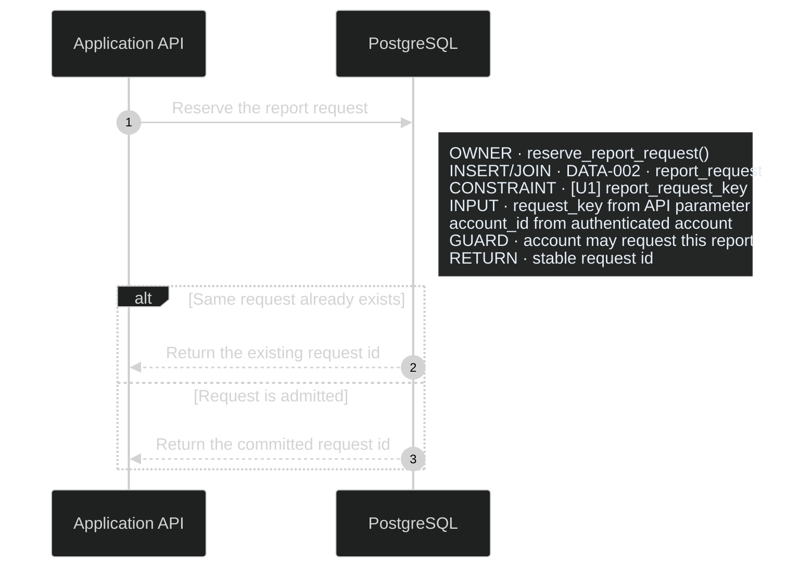

# Diagram Presentation

Recommend these enriched ERD and sequence styles for real application packages.
They make the data and execution context visible at the point where it matters.
Keep sources in Markdown with fenced Mermaid. Use the same presentation across
related files, adding only product-significant detail. These are presentation
conventions, not new artifact types or a requirement to document every column,
call, or branch. [Artifact Responsibilities](artifact-responsibilities.md) owns
the meaning and selection rules.

## Recommended dark-mode style

Default to dark-mode diagram styling unless the project requests another theme.
Use a near-black canvas, dark navy or charcoal panels, light text, and visible
but restrained borders. A useful starting palette is:

| Element | Color |
| --- | --- |
| Canvas | `#101213` |
| ERD rows | `#111827` |
| Entity heading / section heading | `#263544` / `#1f2c38` |
| Primary text / secondary text | `#e5edf5` / `#b8c4d0` |
| Outer borders / row separators | `#8ea0b3` / `#344556` |
| Sequence notes | `#242626` with light text |
| Sequence arrows / lifelines and branch outlines | light gray / muted blue |
| Index badge accents: I / U / P | `#6ea8ff` / `#6fd38a` / `#c58aff` |

For ERDs, use tinted badge fills with brighter outlines and light labels. For
sequences, keep action text and arrows clear against the canvas, use subdued
note panels, and distinguish branch frames without overwhelming the messages.
Keep text labels alongside every color distinction.

Start Mermaid with `config.theme: dark`; style custom HTML table cells and
badges explicitly because they may not inherit the Mermaid theme. Check text,
arrowheads, edge labels, notes, and exports against the actual background.
Adaptive light/dark styles are acceptable if their dark appearance remains
consistent; avoid a mixture of bright default panels and dark custom tables.
This preference governs documentation diagrams, not the product application's
UI theme.

## Custom table-shaped ERDs

Use Mermaid `flowchart` with HTML table labels when the viewer supports them.
This permits richer entity compartments than a plain `erDiagram`:

- A prominent entity heading and four columns: `ATTRIBUTE`, `TYPE`,
  `KEY / RULE`, and `INDEX BADGE`.
- One row per product-significant physical column. Use monospace for field
  names, types, and index names; keep explanatory rules readable and wrapped.
- An `INDEXES` compartment within the same entity, below its attributes. Each
  entry has one base badge, its complete definition, and its process or product
  purpose. Add `COORDINATION` below it only for relevant persisted locks/leases.
- Matching textual and colored badges: blue `I`, green `U`, purple `P`, with
  separately distinguishable lease/lock badges when needed. Include a compact
  legend. Color supplements the notation; it never replaces it.
- Labeled relationships with explicit cardinality and direction of meaning.
  A flowchart line alone does not express ERD cardinality. Use compact dashed
  `REFERENCE · DATA-* · entity` nodes for entities owned elsewhere and link to
  their owners rather than duplicating their fields.

Use restrained borders, contrasting section headers, left-aligned cells, and
adequate spacing. Apply the recommended dark palette consistently. Keep
long definitions wrapped and avoid shrinking text to fit an oversized canvas.
Split by coherent data responsibility when necessary, preserving references.

The [Counter data model](../assets/example-product-intent-package/data/data-model.md)
demonstrates the complete dark table style, per-attribute badges, an attached
index compartment, and explicit cardinality. Its
[sequences](../assets/example-product-intent-package/sequences/sequences.md)
reference that same index without copying its definition. No lease or lock
compartment is needed because the example has no such persisted mechanism.

The established index suffix and one-badge-per-index rules still apply. Qualify
cross-diagram badges by `DATA-*` and table because `[U1]` may occur on several
entities. Keep routine primary keys as `PK` unless their physical index has an
independent product-significant purpose.

HTML labels and custom CSS depend on the Markdown viewer. Check the rendered
result in the intended viewer. Do not require relaxed security settings just
to display a diagram. If tables or styles are unsupported, retain the same
information in an ordinary Mermaid ERD with adjacent Markdown compartments;
do not discard the index or coordination detail. Keep one maintained definition.

## Annotated sequences

Use Mermaid `sequenceDiagram`, `autonumber`, and left-aligned notes. Put the
process title, direct related-record links, and applicable DCL above the diagram.
Use physical participants and clear actor roles. Keep each message focused on
the logical action; attach the extra information next to the participant that
owns it, inside the relevant `alt`, `opt`, `loop`, or `break` branch.

Choose only relevant note labels:

| Label | Detail |
| --- | --- |
| `OWNER` / `CALL` | Intended function, routine, or operation and responsibility |
| `READ`, `INSERT`, `UPDATE`, `DELETE`, `JOIN` | DATA owner, exact table/view, and operation |
| `ACCESS` / `CONSTRAINT` | Table-qualified ERD badge and index name or enforcing constraint |
| `KEY` / `INPUT` | Consequential fields and where their values originate |
| `WRITE` / `RETURN` | Changed fields or returned facts that determine subsequent behavior |
| `GUARD` | Condition that permits or refuses the step |
| `TRANSACTION` | Which changes commit together and where the transaction ends |
| `PRESERVE`, `FREEZE`, `NO WRITE` | Material immutability or mutation boundary |
| `LEASE` / `CONCURRENCY` | Linked mechanism, scope, owner check, or contention behavior |

Use `Note over` for a boundary spanning participants, such as external work
occurring outside a database transaction. Use short line breaks to keep notes
scannable. Move lengthy explanations into nearby supporting notes with direct
references; retain branch-specific facts beside their branch. Link code owners
and current rationale below the diagram when useful.

Arrows and notes together describe current intended runtime behavior. Preserve
the PIP's end-state wording: no reuse/modify tasks or implementation progress.
Do not copy complete index definitions into sequences or fill every step with
every label. Detailed notes earn their place by resolving a real ambiguity.
