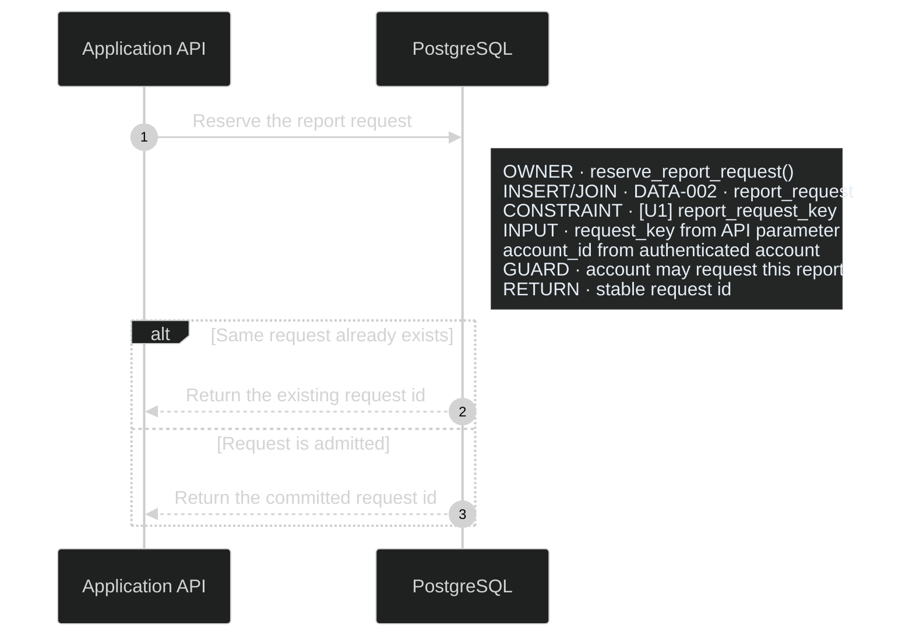
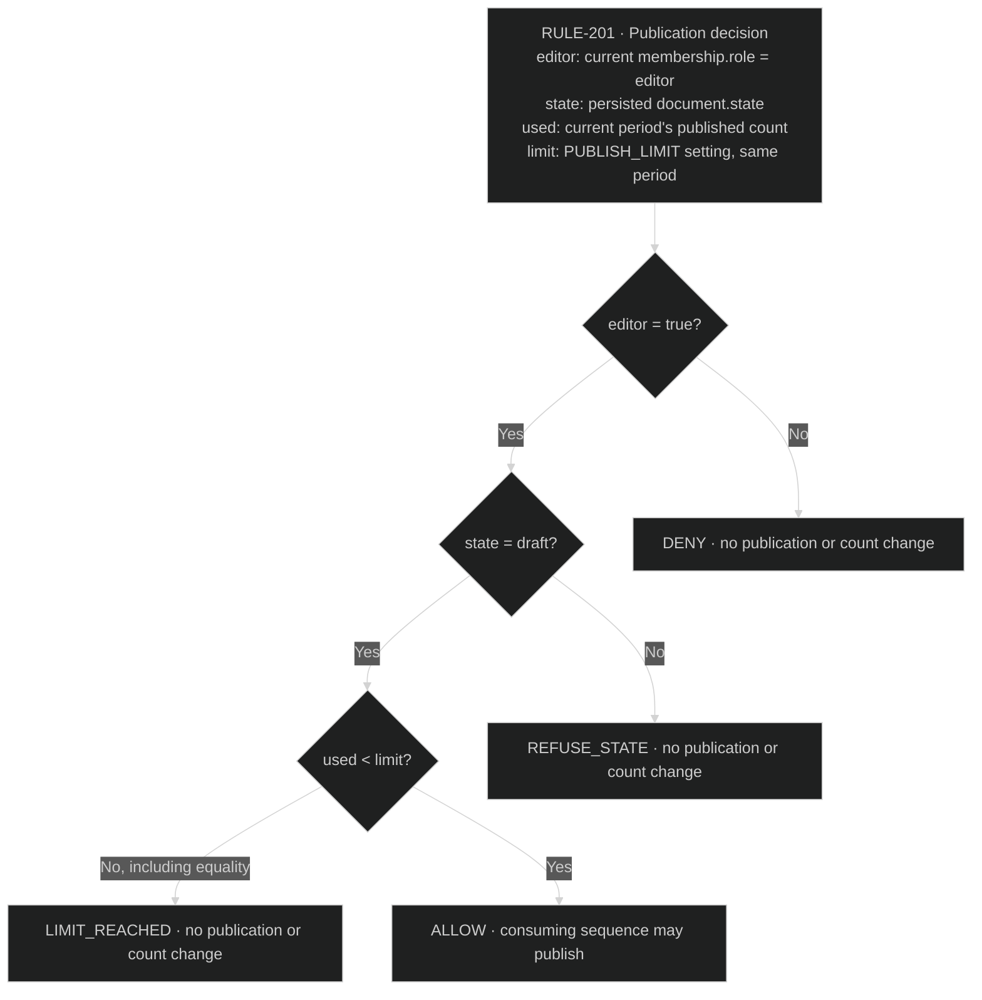

# Diagram Presentation

Use the ERD format rules and recommended sequence style below for application packages.
They make the data and execution context visible at the point where it matters.
Keep sources in Markdown with fenced Mermaid. Use the same presentation across
related files, adding only product-significant detail. These are presentation
conventions, not new artifact types or a requirement to document every column,
call, or branch. [Artifact Responsibilities](artifact-responsibilities.md) owns
the meaning and selection rules.

## Recommended dark-mode style

Default to dark-mode diagram styling unless the project requests another theme.
Use a near-black canvas, dark navy or charcoal panels, light text, and visible
but restrained borders. A useful starting palette is:

| Element | Color |
| --- | --- |
| Canvas | `#101213` |
| ERD rows | `#111827` |
| Entity heading / section heading | `#263544` / `#1f2c38` |
| Primary text / secondary text | `#e5edf5` / `#b8c4d0` |
| Outer borders / row separators | `#8ea0b3` / `#344556` |
| Sequence notes | `#242626` with light text |
| Sequence arrows / lifelines and branch outlines | light gray / muted blue |
| Index badge accents: I / U / P | `#6ea8ff` / `#6fd38a` / `#c58aff` |

For ERDs, use tinted badge fills with brighter outlines and light labels. For
sequences, keep action text and arrows clear against the canvas, use subdued
note panels, and distinguish branch frames without overwhelming the messages.
Keep text labels alongside every color distinction.

Start Mermaid with `config.theme: dark`; style custom HTML table cells and
badges explicitly because they may not inherit the Mermaid theme. Check text,
arrowheads, edge labels, notes, and exports against the actual background.
Adaptive light/dark styles are acceptable if their dark appearance remains
consistent; avoid a mixture of bright default panels and dark custom tables.
This preference governs documentation diagrams, not the product application's
UI theme.

## Custom table-shaped ERDs

For an ERD with product-significant indexes or persisted coordination, start
with Mermaid `flowchart` and HTML table labels. This is the expected format,
not an optional embellishment after a plain `erDiagram`. Follow the fallback
below only for a project-requested format or an observed viewer limitation.
Read the [worked notation example](erd-notation-example.md) before authoring;
adapt its table structure and CSS, not its illustrative schema or mechanisms.
For document stores, also read [Document-database relationships](document-data-models.md)
for the path headings, typed relationship legend, and worked connected groups.

- A prominent entity heading and four columns: `ATTRIBUTE`, `TYPE`,
  `KEY / RULE`, and `INDEX BADGE` (or `INDEX / COORDINATION` when both apply).
  Put the `DATA-*` owner and exact physical table name or document key/path in the entity heading,
  not just a field comment. Qualify references by table when one DATA owner
  covers several physical entities.
- One row per product-significant physical column or document field. Separate
  path components and native index metadata from persisted attributes. Use monospace for field
  names, types, and index names; keep explanatory rules readable and wrapped.
- An `INDEXES` compartment within the same entity, below its attributes. Each
  entry has one base badge, its complete definition, and its process or product
  purpose. Add `COORDINATION` below it only for relevant persisted locks/leases.
- Matching textual and colored badges: blue `I`, green `U`, purple `P`, with
  separately distinguishable lease/lock badges when needed. Include a compact
  legend. Color supplements the notation; it never replaces it.
- Labeled relationships with explicit cardinality and direction of meaning.
  A flowchart line alone does not express ERD cardinality. Use compact dashed
  `REFERENCE · DATA-* · entity` nodes for entities owned elsewhere and link to
  their owners rather than duplicating their fields.
  When field-level attachment is unavailable, label edges with exact,
  endpoint-qualified field/path mappings and cardinality/optionality at both
  ends. Arrowheads never imply execution order or enforcement by the database.

Use restrained borders, contrasting section headers, left-aligned cells, and
adequate spacing. Apply the recommended dark palette consistently. Keep
long definitions wrapped and avoid shrinking text to fit an oversized canvas.
Split by coherent data responsibility when necessary, preserving references.

### Build the entity as one visual

1. Collect the product-significant physical fields and the required index and
   persisted coordination definitions from their owners. Check compound and
   conditional uniqueness stated in prose too. Do not guess a missing physical
   definition or add a mechanism merely to fill a compartment.
2. Put each field in its own attribute row. Keep type and key/rule in separate
   cells. Put each badge in a styled `` in the last cell; several badges
   on one field remain separate spans. Text such as `U1.1` in a quoted Mermaid
   field comment is not a substitute for a badge column.
3. Append `<tr><th colspan='4'>INDEXES</th></tr>` inside that same `<table>`.
   Each entry places its base badge in one cell and its physical name, complete
   definition, and purpose in a `colspan='3'` cell. Use ` ` to separate those
   lines. Include uniqueness, method, ordered keys/directions, expressions,
   included columns, and predicate wherever present. Do not summarize a
   compound key as `UNIQUE` on individual fields or a partial index as just
   "unique when active".
4. Append `COORDINATION` the same way, only when needed. Map the actual persisted
   scope, owner/attempt, activity/expiry, and fence fields to their badges.
   Include the protected resource and a direct link to the process owner.
   Describe structure here; acquisition, renewal, expiry, retries, and stale-
   owner rejection remain in the linked sequence. Do not turn a transient row
   lock into an invented stored lock entity.
5. Match badge colors between fields and compartments and include a textual
   legend. Use the exact bracket/middle-dot notation: `[U1·1]`, `[P2·where]`,
   `[LEASE1·owner]`. The
   [index](artifact-responsibilities.md#product-significant-index-notation) and
   [coordination](artifact-responsibilities.md#product-significant-lock-and-lease-notation)
   rules own suffix meanings. `UK` is a constraint marker, not an index badge.

`INDEXES` and `COORDINATION` are attached sections of their owning entity, not
separate graph nodes, floating notes, or one Markdown table for several
entities. Do not repeat full definitions in prose below the rendered entity.
Use nearby Markdown links when the viewer cannot preserve links inside HTML
labels; this does not require duplicating the definition. A diagram export
should retain the fields, badges, definitions, and role mappings together.

The [Counter data model](../assets/example-product-intent-package/data/data-model.md)
demonstrates the complete dark table style, per-attribute badges, an attached
index compartment, and explicit cardinality. Its
[sequences](../assets/example-product-intent-package/sequences/sequences.md)
reference that same index without copying its definition. No lease or lock
compartment is needed because the example has no such persisted mechanism.

The established index suffix and one-badge-per-index rules still apply. Qualify
cross-diagram badges by `DATA-*` and table because `[U1]` may occur on several
entities. Keep routine primary keys as `PK` unless their physical index has an
independent product-significant purpose.

### Viewer fallback and rendering check

Check the rendered result, not just Mermaid parsing: table cells, dark text
contrast, badge colors, attached compartments, relationship labels, and clipped
or overlapping content. A missing local renderer means rendering is unverified;
it does not establish that the target viewer rejects HTML. Keep the expected
source format and report that limit. Do not enable relaxed security settings
just to display a diagram.

If the project explicitly requests plain ERDs, or the intended viewer actually
rejects table labels, use ordinary Mermaid entities with the same exact textual
badges and per-entity Markdown `INDEXES` / `COORDINATION` sections directly
adjacent. Clearly identify the owning table on every section and preserve full
definitions and role mappings. If only color/CSS is unsupported, keep the table
structure and textual badges. State the chosen fallback and reason in the task
response, not as implementation-status metadata inside the PIP. Keep one
maintained definition; do not ship competing HTML and plain-ERD copies.

## Annotated sequences

Use Mermaid `sequenceDiagram`, `autonumber`, and left-aligned notes. Put the
process title, direct related-record links, and applicable DCL above the diagram.
Use physical participants and clear actor roles. Keep each message focused on
the logical action; attach the extra information next to the participant that
owns it, inside the relevant `alt`, `opt`, `loop`, or `break` branch.

Choose only relevant note labels:

| Label | Detail |
| --- | --- |
| `OWNER` / `CALL` | Intended function, routine, or operation and responsibility |
| `READ`, `INSERT`, `UPDATE`, `DELETE`, `JOIN` | DATA owner, exact table/view or collection/document path, and operation |
| `ACCESS` / `CONSTRAINT` | Table-qualified ERD badge and index name or enforcing constraint |
| `KEY` / `INPUT` | Consequential fields and where their values originate |
| `WRITE` / `RETURN` | Changed fields or returned facts that determine subsequent behavior |
| `GUARD` | Condition that permits or refuses the step |
| `TRANSACTION` | Which changes commit together and where the transaction ends |
| `PRESERVE`, `FREEZE`, `NO WRITE` | Material immutability or mutation boundary |
| `LEASE` / `CONCURRENCY` | Linked mechanism, scope, owner check, or contention behavior |

Use `Note over` for a boundary spanning participants, such as external work
occurring outside a database transaction. Use short line breaks to keep notes
scannable. Put behavioral detail in rendered branches and attached notes; split
into linked diagrams when needed. Only non-normative explanation and causal
rationale move below the diagram. Keep code ownership visible at its step and
use nearby links for exact code destinations.

Arrows and notes together describe current intended runtime behavior. Preserve
the PIP's end-state wording: no reuse/modify tasks or implementation progress.
Do not copy complete index definitions into sequences or fill every step with
every label. Detailed notes earn their place by resolving a real ambiguity.

## Rules and gates as visible decisions

Use process-local sequence branches for gates that belong to one operation.
For shared selection logic, use a focused Mermaid decision flowchart with exact
predicates, precedence, and outcomes. A box saying “apply rules” is a link to
another diagram, not a substitute for one. A paragraph pasted into a giant note
is not a decision diagram: put consequential alternatives on distinct paths.
Calculations and invariants that do not branch can use concise attached notes
or entity rows. Keep failure/refusal consequences visible beside their condition.

### Worked rule: publication decision

This synthetic rule demonstrates notation, not required product behavior.
`RULE-201` owns selection only; its consuming sequence owns fetching inputs,
authorization enforcement, transaction boundaries, and publication. The diagram
includes input provenance, priority, the exact limit comparison, and each result.

The ordering makes refusal precedence inspectable. Consuming sequences link to
this diagram and branch on its returned result without repeating the predicates.
An input lookup failure belongs to the consuming sequence's failure path; it
must not silently become `ALLOW`. For a real product, use its actual rule and
sequence owners rather than importing this example's roles or quota.
