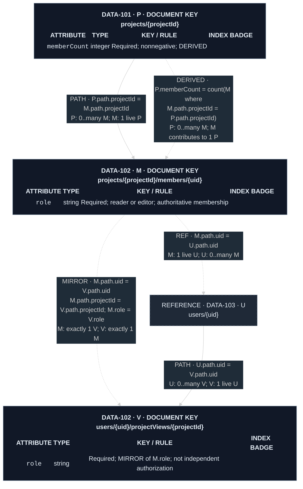
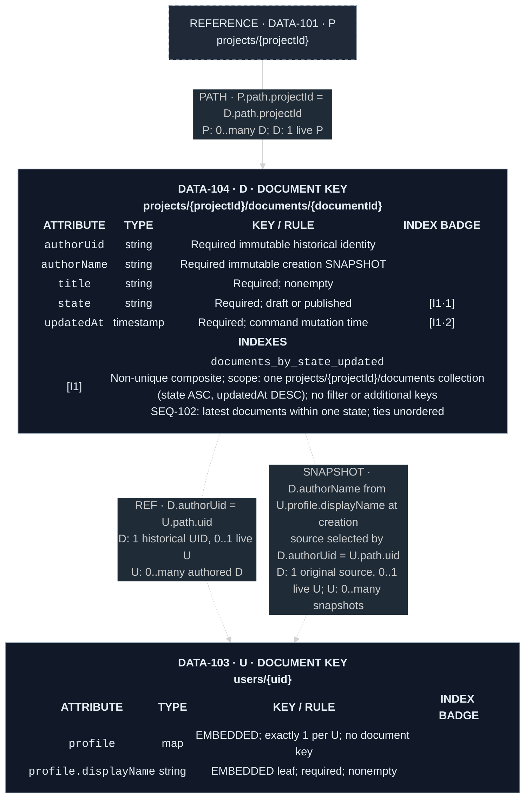
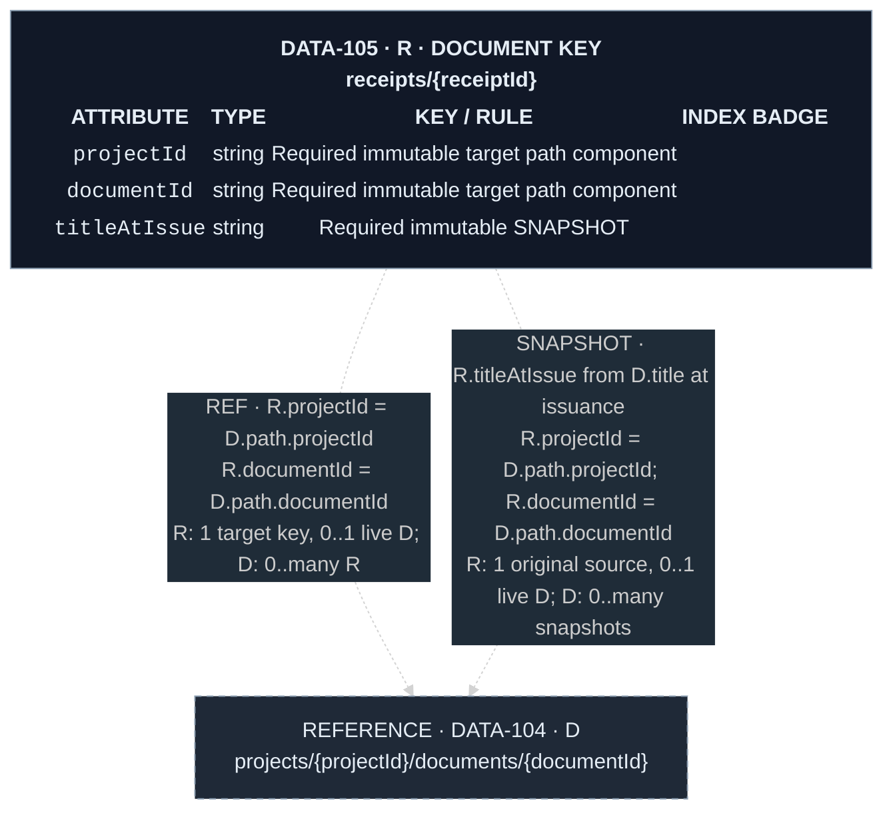
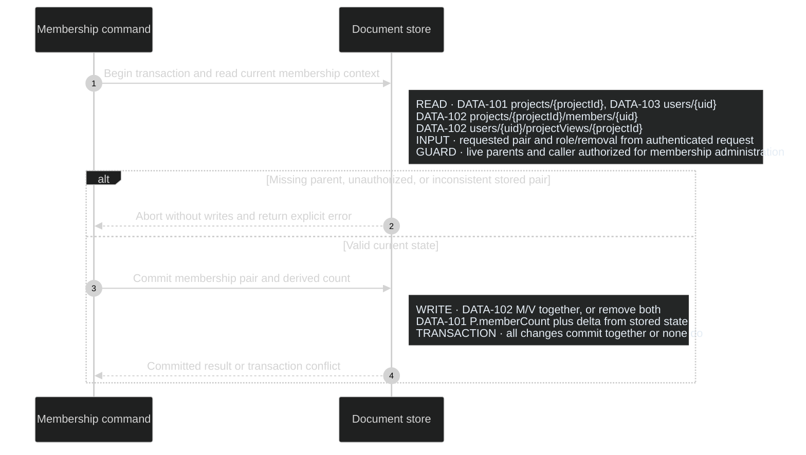

# Document-database relationships

Use this alongside [Diagram Presentation](diagram-presentation.md) when the
PIP uses a NoSQL/document store. A data model describes product relationships,
not merely database-enforced foreign keys. Derive its edges from document paths,
reference fields, and canonical product invariants. Do not infer a relationship
from an index, shared field name, or coincidentally equal value.

## Keys, fields, and edges

- Put the `DATA-*` owner and exact document key in the entity heading, such as
  `DOCUMENT KEY · projects/{projectId}/members/{uid}`. Name collection scope too
  when it is not evident from the path. For stores without hierarchical paths,
  name the collection and actual key expression instead; do not invent nesting.
- Reserve `path.projectId` and `path.uid` for path components. They are not
  stored fields unless the real schema separately persists them; if it does,
  show that field and the required equality with the path. Do not invent `id`
  columns. Show nested field paths exactly, and distinguish absent from null
  wherever that changes behavior.
- Mark embedded maps/arrays inside the owning document. Give consequential
  nested fields their own rows (for example `profile.displayName`); a map row
  must not hide product-significant leaves. A separately drawn embedded shape
  is labeled `EMBEDDED SHAPE`, never a collection or independent document.
- Identify backend-native metadata explicitly, for example an index's native
  document-name key; it is not an extra persisted field. Do not assume every
  store uses the same metadata names or ordering. Index badges may attach to
  such a labeled row only when the actual index includes that key.
- Every relationship edge names its kind, exact source-to-target field/path
  mapping, and cardinality/optionality at **both** ends. Qualify ambiguous
  fields with node aliases or `DATA-*` and collection. In a Mermaid table-node
  diagram without field ports, the edge label owns this mapping; proximity to
  a row does not. `A.ownerUid = U.path.uid` is precise; `belongs to user` is not.
- Distinguish a required identity from a currently existing target document.
  A required historical ID can have `0..1` live targets. State the write-time
  existence rule, later retention/deletion rule, and missing-target behavior.
  Cardinality expresses intended valid states; name any allowed intermediate
  cleanup or synchronization state rather than implying instant consistency.

## Consistent legend

Use textual tags even when color or line style also distinguishes an edge.
Arrow direction is structural/reference meaning, never execution order.

| Tag | Representation and meaning |
| --- | --- |
| `EMBEDDED` | In-entity map/array rows; if expanded separately, a solid edge from document to labeled embedded shape, with exact field path and multiplicity. No independent document identity. |
| `PATH` | Solid arrow from parent to subcollection child, with exact parent/child path-component mapping and both-end multiplicity. No automatic cascade or proof that the parent document exists. |
| `REF` | Dashed arrow from referring record to target; exact field/key equality, optionality, and allowed target absence. Not an FK unless the actual database enforces one. |
| `MIRROR` | Dashed, explicitly tagged relation between two stored representations of one fact; exact identity mappings and equal field set. Identify the authoritative side or command owner and allowed lag. Not just two copies with related IDs. |
| `SNAPSHOT` | Dashed arrow from retained copy to its source; exact provenance and capture time/event. Values need not equal the source now. State refresh and retention policy. |
| `DERIVED` | Dashed arrow from aggregate to source set; exact grouping/filter and aggregate expression. State consistency/freshness and repair owner. Not a reference to one source row. |
| `REFERENCE · DATA-*` | Dashed-border, abbreviated node linked to its full owner; include the key/mapping fields needed locally, without duplicating their definitions. This node style is not itself a relationship kind. |
| `[I…]`, `[U…]`, `[P…]` | Entity-local index badges using the existing suffix rules. They describe access definitions and any actual uniqueness, not relationships or referential integrity. |

Containment and provenance may both apply to the same data: an embedded snapshot
is physically embedded and has snapshot semantics. Label both instead of
turning it into another collection. Omit kinds the product does not use.

## Enforcement, lifecycle, and access

Name the actual consistency owner on the relationship or in a concise rendered
note attached to its entity and linked to its sequence: database constraint, named security rule,
command transaction, or maintenance process. Be specific about what it
enforces. Security rules that restrict reads do not automatically validate
references; rules for client writes need not govern privileged server writes.
Transactions only protect the checks and mutations actually included by the
named command. Do not invent backend guarantees, uniqueness indexes, mandatory
transactions, or repair jobs to make a diagram look complete. Resolve a material
unspecified invariant through PIP authority.

In the rendered data view, state whether mirror/aggregate equality is atomic or eventual and which
owner handles allowed divergence. For snapshots, state capture/refresh policy.
For deletion, name cascade, explicit cleanup, tombstone, retention, or intentional
dangling-reference behavior as applicable. `PATH` alone means none of these.
Knowing a path or following a reference never grants authorization.

Keep indexes inside their owning entity's `INDEXES` compartment. Record the
actual native definition, scope, ordered fields/directions or index modes,
filter where supported, and process purpose. Do not force SQL `BTREE`, `FK`, or
`UNIQUE` onto a backend that does not provide them. An exact document-key lookup
does not require an invented secondary-index badge. A unique index, where
supported, enforces its uniqueness condition, not existence of another record.

Group related entities into connected, readable diagrams, using abbreviated
references across groups. Split by data responsibility before shrinking text.
ERDs own structure, cardinality, consistency ownership, and lifecycle rules;
sequences own synchronization order, transaction boundaries, retries, cleanup
steps, and failure recovery. Link the sequence rather than drawing those steps
as data-model edges. Keep these facts in rendered labels or attached notes,
not prose below the diagram; supporting prose explains rationale and links.

## Worked example: project documents

This is a synthetic formatting example, not a default application schema or a
vendor-specific migration. Its illustrative store has hierarchical document
keys and scoped non-unique composite indexes; the index declaration below is
logical native configuration, not executable DDL. Adapt only notation justified
by the actual product/backend. All described consistency is command-enforced;
there are no foreign-key constraints. The key identifies at most one document,
but does not guarantee that a parent or referenced document exists.

The aliases `P`, `M`, `V`, `U`, `D`, and `R` qualify edge fields. Every
`path.*` value comes from its document key, not an attribute row. Index badge
colors follow the shared legend: blue `I`, green `U`, purple `P`; this example
needs only `I`. Embedded rows use the `EMBEDDED` tag in `KEY / RULE`.

### DATA-101 Projects and DATA-102 Membership pairs

Owner: [DATA-103 Users](#data-103-users-and-data-104-documents).
Enforcement: [SEQ-101](#seq-101-membership-mutation) maintains the mirror and
count atomically, checking both live parent documents. `M` is authoritative;
`V` only supports personal discovery. There is no allowed committed mirror lag.
Parent deletion is refused while `M`/`V` children exist; project deletion also
requires no `D` documents. `PATH` causes no automatic cleanup. Security rules
allow scoped reads and deny direct client writes to all illustrated entities;
trusted commands enforce the stated authorization and integrity themselves.

### DATA-103 Users and DATA-104 Documents

Owner: [DATA-101 Projects](#data-101-projects-and-data-102-membership-pairs).
Enforcement: [SEQ-102](#seq-102-document-access-and-lifecycle) requires a live
author and project when creating `D`, and current editor membership for writes.
User deletion retains documents and their attribution; UIDs are never reassigned.
The immutable `authorName` snapshot does not track profile edits. Missing users
display the retained attribution without a profile link. The two dashed edges
describe identity and provenance, not two separate author documents.

### DATA-105 Receipts

Owner: [DATA-104 Documents](#data-103-users-and-data-104-documents).
Enforcement: [SEQ-102](#seq-102-document-access-and-lifecycle) requires a live,
authorized document at receipt issuance. Receipt keys and title snapshots
survive document/project deletion until explicit receipt removal; target keys
are never reused. If the target is gone, reads show the snapshot and no live
document link. A receipt never grants access to a surviving document. No index
is necessary to illustrate this exact-key reference.

### SEQ-101 Membership mutation

This illustrative sequence owns synchronization, not the data-model arrows.
It governs add, role change, and removal; `delta` is +1 only for absent-to-present,
-1 only for present-to-absent, otherwise 0, determined from the stored pair.

On conflict the command retries the complete transaction within its request
deadline, re-reading guards and membership state; exhaustion returns a retryable
error without claiming success. A repeated desired-state request has delta 0
when already satisfied. The count is authoritative committed state, not an
eventually refreshed cache; this example does not add a maintenance job.

### SEQ-102 Document access and lifecycle

These are abbreviated process-owner notes for the formatting reference, not a
complete release PIP. A real package links its actual owning sequences.
Creation reads the live project, author, and current membership before storing
the attribution snapshot in the same guarded transaction. Listing reads
`DATA-104 documents [I1]` within the authorized project and selected state.
Receipt issuance reads the authorized current document and commits its exact
key and title snapshot atomically. Deletion checks current authorization;
document deletion leaves receipts untouched. Parent deletion transactionally
checks the stated child-absence guards, and every child-creation command checks
the live parent in its transaction. Reads reauthorize live targets independently
of retained references and use the specified missing-target presentation.

### Current rationale

The membership mirror supports personal discovery while the authoritative
membership owns access. Its atomic count and pair avoid contradictory committed
membership views. Attribution and receipt snapshots preserve historical meaning
after source edits or deletion; they are deliberately not mirrors. Explicit
path mappings prevent repeated local IDs from being mistaken for globally
unique identities. Attached indexes explain access without implying integrity.
