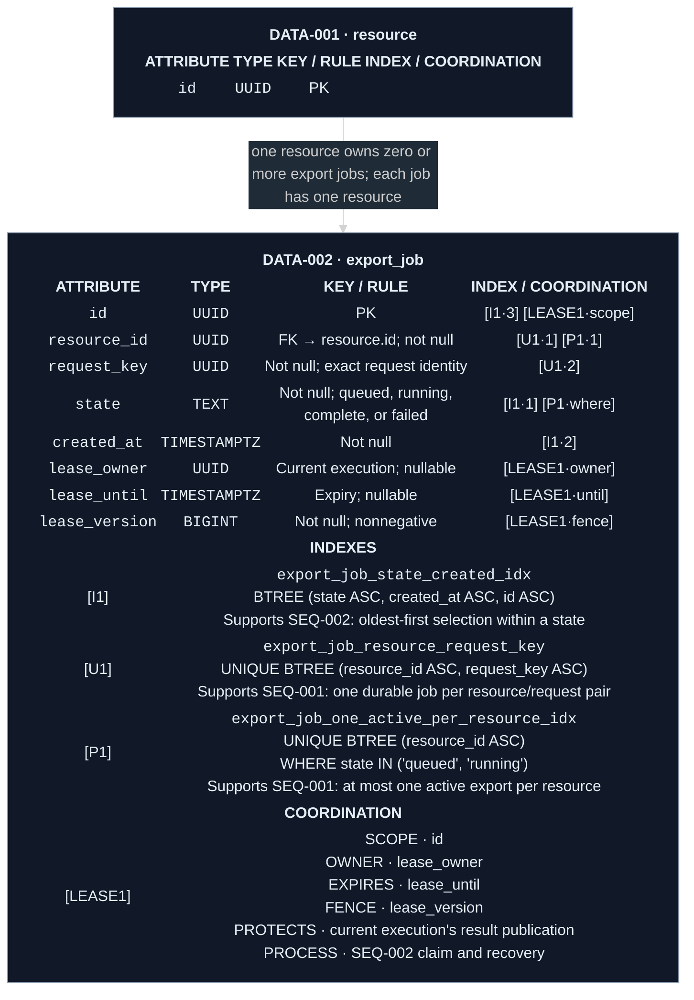

# Worked ERD notation

This is a formatting reference, not a default PIP file or a proposed application
schema. It demonstrates ordinary, composite-unique, and partial-unique indexes,
multiple badges on one field, and a persisted lease in one entity. Adapt only
the presentation needed for the product's existing intent. Do not add these
indexes, columns, or a lease merely because they appear here.

Keep each quoted HTML table label on one source line: some Mermaid renderers
turn embedded newlines into unwanted blank space above the table. Use explicit
` ` inside cells for intended line breaks. Keep `themeCSS` readable on
separate lines; `theme: dark` alone does not style custom HTML. Each badge has
text, a tinted fill, and a bright border.

## Data view

Legend: blue `I` = ordinary non-unique index; green `U` = ordinary unique index;
purple `P` = partial/expression/specialized index (which can also be unique);
cyan `LEASE` = persisted coordination. Numeric suffixes mark ordered keys.
`·where` marks a predicate-only column. Lease suffixes identify stored roles.

Related process owners: [SEQ-001 admission](#seq-001-admission) and
[SEQ-002 claim and recovery](#seq-002-claim-and-recovery). These short notes give
the illustration's references a destination; a real package links its actual
sequence owner instead.

## SEQ-001 Admission

Admission owns request replay and the active-export guard. Its database notes
reference `DATA-002 export_job [U1]` and `[P1]`; their complete physical
definitions remain in the entity. Neither key of the compound `[U1]` is
individually unique.

## SEQ-002 Claim and recovery

Claiming owns oldest-first selection through `DATA-002 export_job [I1]`.
Recovery owns lease acquisition, renewal, expiry, and stale-publication
rejection through `[LEASE1]`. A sequence uses these identifiers and the exact
table name rather than copying the entity's full definitions.

## Why the layout matters

- `resource_id` has two independent index badges because two definitions use it.
- `state` has a direct-key badge for `[I1]` and a predicate-only badge for
  `[P1]`; a field's role is evaluated separately for each index.
- `id` remains a routine `PK`. Its `[I1·3]` badge belongs to the separate
  ordering index, not a newly documented primary-key index.
- The lease's scope, owner, expiry, and fence are attached to their exact
  physical rows. They are not ambiguous `C1` comments or floating prose.
- A diagram export retains the definitions and their purposes inside the entity.
  The process links resolve detailed runtime behavior without repeating it.

For an included column use `[I1·inc]`; for an indexed expression use the owning
index's `·expr` badge on its source field and show the full expression in the
index definition. Add only roles that the actual definition contains. See
[the complete suffix rules](artifact-responsibilities.md#product-significant-index-notation).
